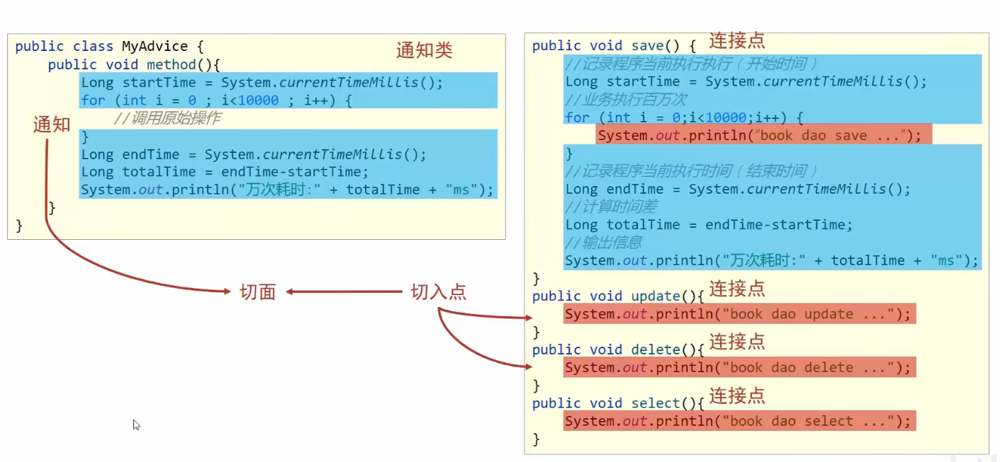

# AOP

### 面向切面编程

作用：在不惊动原始设计的基础上为其进行功能增强

### 概念：
* 连接点（JoinPoint）：程序执行过程中的任意位置，粒度为执行方法、抛出异常、设置变量等
  * 在springAOP中理解为方法的执行
* 切入点（Pointcut）：匹配连接点的式子
  * 在springAOP中。一个切入点可以只描述一个具体方法，也可以匹配多个方法
* 通知（Advice）：在切入点处执行的操作，也就是共性功能
  * 在SpringAOP中，功能最终以方法的形式呈现
* 通知类：定义通知的类
* 切面（Aspect）：描述通知与切入点的对应关系

有人这样形容它们之间的关系：  
连接点（可选择的所有英雄）切入点（已选择的英雄）通知（某个增益buff）通知类（所有增益buff）切面（带了buff的已选择英雄）


* 前置通知（Before advice）：在某连接点之前执行的通知，但这个通知不能阻止连接点之前的执行流程（除非它抛出一个异常）。
* 后置通知（After returning advice）：在某连接点正常完成后执行的通知：例如，一个方法没有抛出任何异常，正常返回。
* 异常通知（After throwing advice）：在方法抛出异常退出时执行的通知。
* 最终通知（After (finally) advice）：当某连接点退出的时候执行的通知（不论是正常返回还是异常退出）。
* 环绕通知（Around Advice）：包围一个连接点的通知，如方法调用。这是最强大的一种通知类型。环绕通知可以在方法调用前后完成自定义的行为。它也会选择是否继续执行连接点或直接返回它自己的返回值或抛出异常来结束执行。


### 简单的入门案例

AOP通知类
```java
@Component  
@Aspect     // 告诉Spring使用了AOP
public class MyAdvice {
    // 切入点，描述的切入点
    @Pointcut("execution(void org.AOP.dao.BookDao.update())")
    private void pt(){}

    @Before("pt()") // 前置通知，括号内是哪个切入点
    public void method(){
        System.out.println(System.currentTimeMillis());
    }
}
```

Spring配置类
```java
@Configuration
@ComponentScan("org.AOP")
@EnableAspectJAutoProxy     // 告诉Spring, 我们使用注解开发的AOP
public class SpringConfig {
}
```

main函数
```java
public class App {
    public static void main(String[] args) {
        ApplicationContext ctx = new AnnotationConfigApplicationContext(SpringConfig.class);
        BookDao bookDao = ctx.getBean(BookDao.class);
//        bookDao.save();
        bookDao.update();
    }
}
```

### 切入点表达式


### 通知类型

前置通知，后置通知  

环绕通知：环绕通知必须依赖形参ProceedingJoinPoint才能实现对原始方法的调用，进而实现原始方法调用前后同时添加通知

可以依赖此操作进行隔离和校验
```java
@Component
@Aspect
public class MyAdvice {

    @Pointcut("execution(int org.AOP.dao.BookDao.select())")
    private void pt() {
    }

    @Before("pt()")     // 前置通知
    public void before() {
        System.out.println("before advice...");
    }
    
    @After("pt()")      // 后置通知
    public void after() {
        System.out.println("after advice...");
    }
    
    @Around("pt()")     // 环绕通知，需要加上 ProceedingJoinPoint 参数
    // 如果切入点方法有返回值，那么最好把本方法的返回值设置为Object
    public Object around(ProceedingJoinPoint pjp) throws Throwable {
        System.out.println("around before advice...");
        //在这之前的语句都会在方法之前运行
        Object pre = pjp.proceed(); // 表示运行该切入点方法
        // 在这之后的语句会在该方法运行之后运行
        System.out.println("around after advice...");
        return pre;  // 将select方法的返回值return
    }
}
```

运行结果如下
```
around before advice...
before advice...
book dao select...
after advice...
around after advice...
100   // 打印 select() 方法的返回值
```

返回后通知：没抛异常才运行  
抛出异常后通知：抛了异常才运行  
```java
@Component
@Aspect
public class MyAdvice {
    @Pointcut("execution(int org.AOP.dao.BookDao.select())")
    private void pt(){}

    @AfterReturning("pt()")  // 只有当方法在没有抛异常正常运行后才会执行
    public void afterReturning(){
        System.out.println("afterReturning advice...");
    }

    @AfterThrowing("pt()")  // 当方法出现异常后运行
    public void afterThrowing(){
        System.out.println("afterThrowing advice...");
    }
}
```


