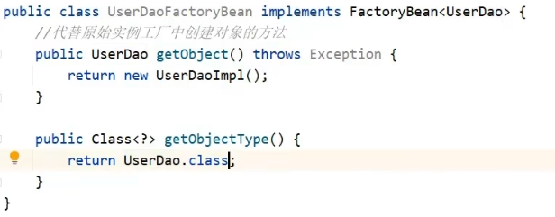

# 配置简单的bean

## xml 配置 bean

首先要在pom.xml文件添加依赖 

```
        <dependency>
            <groupId>org.springframework</groupId>
            <artifactId>spring-context</artifactId>
            <version>6.0.9</version>
        </dependency>
```

准备接口和实现类  
接口
```java
package org.quick.Dao;

public interface BookDao {
    void save();
}
```
类  
```java
package org.quick.Dao.Impl;

import org.quick.Dao.BookDao;

public class BookDaoImpl implements BookDao {
    @Override
    public void save() {
        System.out.println("BookDao save..");
    }
}
```

在 `resource` 文件夹创建 `Spring Config` 的xml配置文件

```xml
    <!--2. 配置bean-->
    <!--bean标签配置-->
    <!--id属性表示给bean起名字-->
    <!--class属性表示给bean定义类型-->
    <!--name：别名(空格、分号、逗号分割)-->
    <!--scope:定义bean的作用范围：singleton 单例的（默认）、prototype 非单例-->
    <!--init-method: 初始bean方法 destroy-method销毁bean方法-->
    <bean id="BookDao" class="com.quickstart.Dao.impl.BookDaoImpl"/>
```

Main 方法中获取IoC容器和bean
```java
public class App {
    public static void main(String[] args) {
        // 获取IoC容器
        ApplicationContext ctx = new ClassPathXmlApplicationContext("applicationContext.xml");
        // 获取bean, 引号里是bean的id
        BookDao bookDao = (BookDao) ctx.getBean("BookDao");
        bookDao.save();
    }
}
```

## 使用静态工厂实例化bean

首先创建静态工厂和静态方法
```
<!-- 大体上和普通的构造方法构造bean差不多，class选工厂类，factory-method是实例化的方法-->
<bean id="userDao" class="factory" factory-method="getMethod"/>
```

## 实例化工厂实例化bean

实例化工厂的方法不是静态方法  
所以配置bean的时候，工厂和实例化的bean都要配置
```
<bean id="factory" class="factoryImpl"/>
<!-- factory-bean 指定工厂的bean -->
<bean id="Dao" factory-method="getDao" factory-bean="factory"/>
```

## 实现FactoryBean实例化bean


```
<!-- class 是实现FactoryBean的类 -->
<bean id="userDao" class="factoryBean"/>
```

配置bean的初始化，销毁方法  
* 第一种方法，自己配置  
`init-method`: 初始bean方法   
`destroy-method`: 销毁bean方法  

```xml
    <bean id="BookDao" class="com.quickstart.Dao.impl.BookDaoImpl" init-method="init" destory-method="destory"/>
```
* 第二种方法，实现接口，重写方法  
     * `InitializingBean` 接口，初始化
     * `DisposableBean` 接口，销毁
